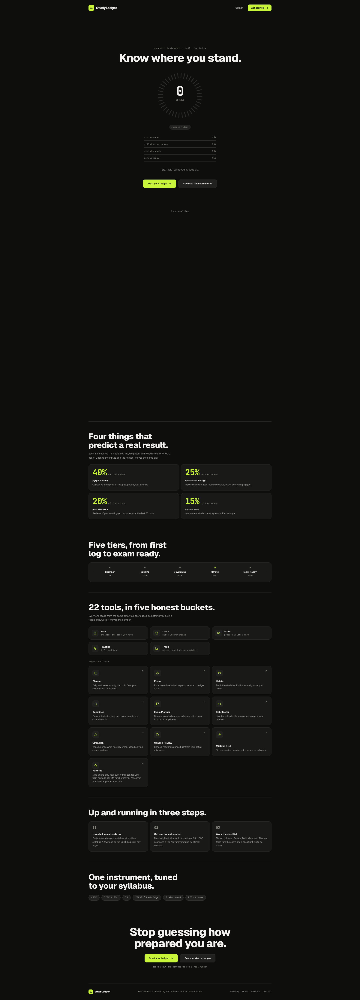
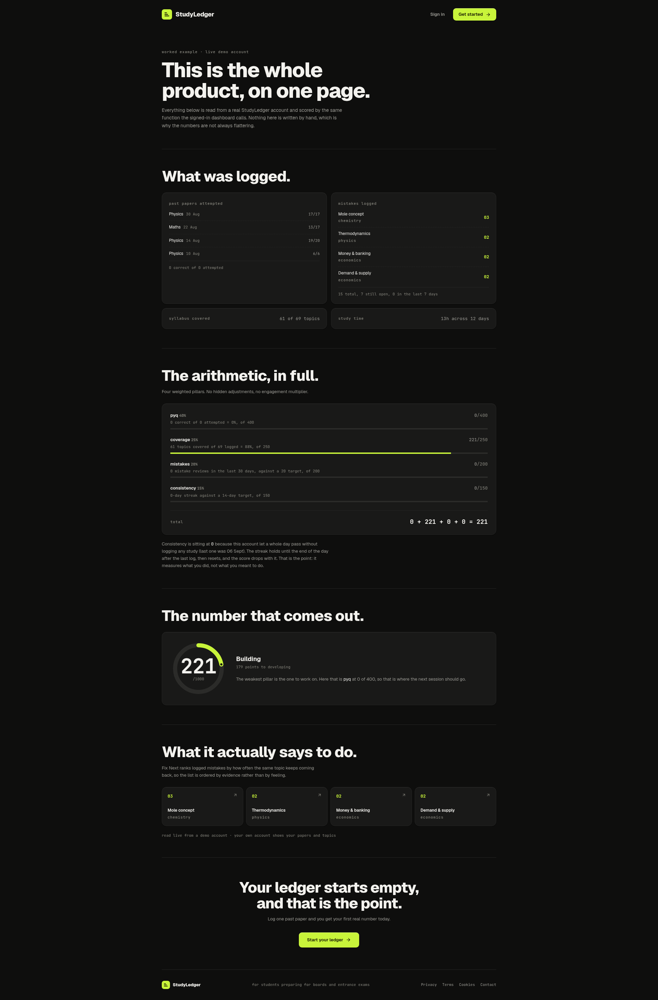
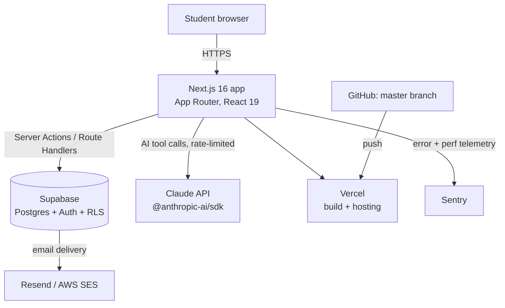

# StudyLedger — Case Study

[studyledger.in](https://studyledger.in) is an exam-prep platform for Indian students (CBSE, ICSE, IB, IGCSE, State Board, NIOS), built and run solo on Next.js, Supabase, and Claude. It turns logged study data — past-paper attempts, syllabus coverage, mistakes, study time — into one 0–1000 "Ledger Score" and a set of tools that act on it.

This repository is a **public case study only**: architecture, stack, and screenshots. It does not contain the product's source code, which is closed.

## What it does

- Students log past-paper (PYQ) attempts, mark syllabus topics covered, log mistakes, and track study sessions.
- A scoring engine rolls four weighted pillars — PYQ accuracy, syllabus coverage, mistake-review work, and consistency — into a single Ledger Score (0–1000) and one of five tiers (Beginner → Exam Ready).
- 22 tools, grouped into five categories (Plan, Learn, Write, Practise, Track), all read from the same underlying ledger data, so using a tool moves the score rather than being disconnected busywork.
- An AI layer (Claude via the Anthropic API) powers assistive features inside some tools, behind per-user and org-wide rate limits.

## How it works

- **Frontend/backend**: a single Next.js 16 app (App Router) — server actions and route handlers under `app/api` do the data access, no separate backend service.
- **Data**: Supabase (Postgres) for storage and auth, with row-level security policies gating per-user data.
- **AI**: Claude (Anthropic API) called from server-side code for assistive tool features, behind request-rate and token-budget limits.
- **Deploy**: GitHub → Vercel, auto-deploy on push to `master`.
- **Observability**: Sentry for error and performance tracking.

## Stack

- **Framework**: Next.js 16 (App Router), React 19, TypeScript
- **Styling**: Tailwind CSS v4
- **Database/Auth**: Supabase (`@supabase/ssr`, `@supabase/supabase-js`), Postgres with RLS
- **AI**: Anthropic SDK (`@anthropic-ai/sdk`)
- **Testing**: Vitest, Testing Library
- **Observability**: Sentry (`@sentry/nextjs`)
- **Hosting**: Vercel

## Results & Limitations

Known limitation: one accumulation path in the focus-tracking logic reads-then-adds instead of using an atomic upsert, and isn't yet covered by a test.
